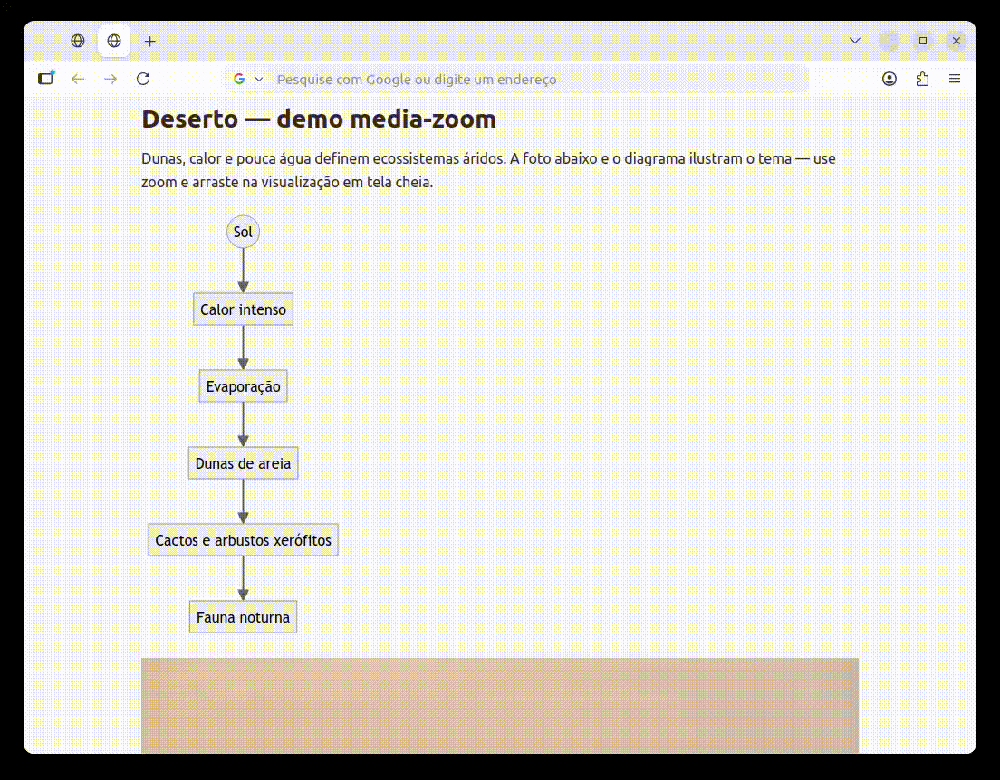

# zensical-media-zoom

Lightweight zoom and pan fullscreen viewer for **Mermaid diagrams** and **inline images** in [Zensical](https://github.com/zensical/zensical) documentation sites.

Two static files (CSS + JS), no build: copy into your project and register them in `zensical.toml`.



## Features

- Click or keyboard (Enter / Space) on a diagram or image to open a fullscreen overlay
- Pan with pointer drag; zoom with toolbar buttons, mouse wheel, or `+` / `-` keys
- Sharp Mermaid zoom on Chromium (hybrid CSS `zoom` + SVG sizing); Firefox uses SVG sizing
- Works with Mermaid rendered inside a **closed Shadow DOM** (moves the `div.mermaid` host instead of cloning SVG)
- Brief fullscreen hint when content enters the viewport; hint on hover / focus
- Re-initializes on instant navigation (`document$` subscription)
- Skips images inside links, emoji, and Mermaid blocks

## Requirements

- [Zensical](https://github.com/zensical/zensical) with instant navigation
- Mermaid enabled via `pymdownx.superfences` custom fence in `zensical.toml`

## Installation

1. Copy from this repository into your site’s `docs/` folder:

   ```text
   javascripts/media-zoom.js   → docs/javascripts/media-zoom.js
   stylesheets/media-zoom.css  → docs/stylesheets/media-zoom.css
   ```

2. In `zensical.toml`:

   ```toml
   extra_css = ["stylesheets/media-zoom.css"]
   extra_javascript = ["javascripts/media-zoom.js"]

   [project.markdown_extensions.pymdownx.superfences]
   custom_fences = [
     { name = "mermaid", class = "mermaid", format = "pymdownx.superfences.fence_code_format" }
   ]
   ```

3. Build or serve the site and test a page with Mermaid or an inline image.

## Customization

- **Accessibility strings** in `media-zoom.js`
- **Zoom limits**: `MAX_SCALE_IMAGE` (8) and `MAX_SCALE_MERMAID` (16) at the top of the JS file
- **Styling** uses Zensical theme CSS variables (`--md-default-bg-color`, etc.)

## License

MIT — see [LICENSE](LICENSE).
